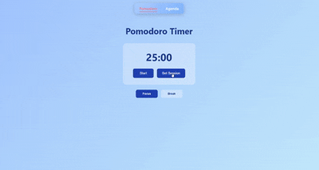

# ⏳ pomodoro app

a customizable pomodoro timer designed to improve focus and productivity, with built-in task management and flexible timing controls.

## ✨ technologies

- react.js  
- javascript  
- css  

## 🚀 features

- customizable pomodoro duration  
- adjustable break intervals  
- agenda page to add and manage tasks  
- task categorization for better organization  
- local storage for saving tasks and settings  
- notifications and alerts for session tracking  
- clean and minimal ui for focused usage  
  
## 🎞️ preview

## 📍 the process

i wanted to build a productivity tool that was simple but flexible. most pomodoro apps feel restrictive, so i focused on allowing users to customize both work and break durations based on their preferences.

i also added an agenda section to make it more practical, so users can plan and organize their tasks instead of just tracking time.

the goal was to create something that feels lightweight but actually useful for day-to-day productivity.

## 📚 what i learned

- managing timer-based logic in react  
- handling state updates over time  
- designing simple but functional user interfaces  
- structuring features around user productivity
- implementing local storage to persist user data across sessions  
- integrating browser notifications to improve productivity tracking    

## 💭 improvements
  
- add statistics and productivity tracking  
- improve mobile responsiveness  

## ⚠️ usage

this project is built for learning purposes.

feel free to explore and take inspiration from it.
